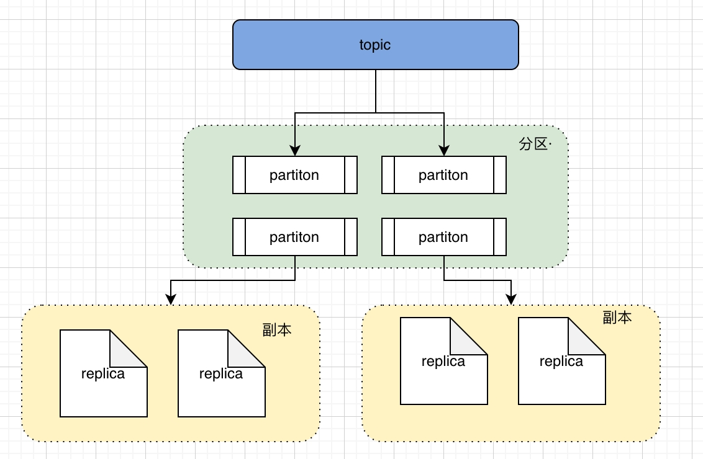
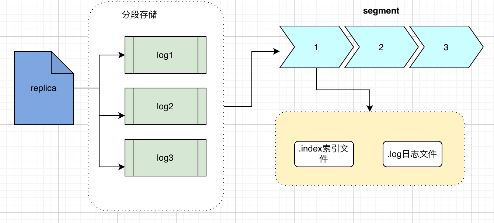
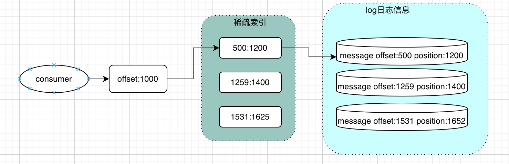

目前互联网公司消息中间件使用比较多的有 Mq，Kafka；双方各自有各自的优缺点，这次简单介绍的 kafka 相关的一些使用

## 基础介绍

这次主要介绍的 Apache Kafka，kafka 有几种不同的版本，本次主要介绍的 Apache Kafka。Apache Kafka 是一种分布式数据存储，经过优化以实时提取和处理流数据。要掌握 kafka，先熟悉下 kafka 的一些核心术语

- Topic 主题，把发送和订阅的不同消息，定义为不同的主题
- Producer 消息生产者，即向主题发布消息的客户端应用程序
- Consumer 消息消费者，即订阅了主题消息的客户端应用程序
- Consumer Group 即一组消费者消费多个分区
- Clients 消息发送着的客户端应用和订阅消息的客户端应用统一称为 Clients
- Broker Kafka 集群中的一台或多台服务器统称 broker
- Partition 是 Topic 的物理分组，每个主题划分成多个分区，每个分区是一组有序的消息日志
- Replication 副本，kafka 会将相通的数据拷贝到多台机器，拷贝的数据就是副本
- Offset 表示分区中每条消息的位置信息
- Consumer Offset 是消费者的消费进度

## kafka 存储原理

kafka 的存储是基于顺序追加写日志，提高数据的写操作；索引是稀疏哈希索引，提高数据的读性能

> kafka topic，Partition 和 Replication 的关系
> 
> Partition 分区又被划分成了多个 LogSegment，这是为了防止 Log 日志过大，Kafka 又引入了日志分段（LogSegment）的概念，将 Log 切分为多个 LogSegement，方便查找
> 
> 对于每个块，我们只需要索引当前块的第一条消息的 Offset，找到 Offset 大小找到对应的块，然后再从块中顺序查找，就可以检索到本条消息

## kafka 复制

## kafka 消费机制
