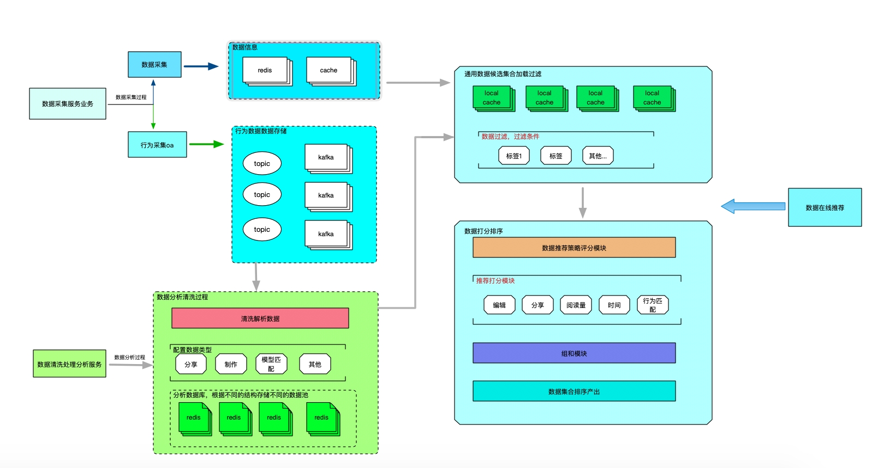

经常看头条，刷视频都会根据用户的一些标签属性，推荐给用户相关的内容，不管是电商，新闻，社交，短视频业务基本的推荐流程都大同小异，这里只简单介绍一个推荐系统简单的架构体系

## 基础数据

推荐系统主要大体上可以分为三个部分，分别是数据采集，数据分类，算法推荐。

- 数据采集
  > 将用户在 App 或者其他端上的行为通过一定的格式收集到统一的数据平台
- 数据分类
  > 根据采集的数据，进行数据清洗分类，按照不同的业务维度进行存储
- 算法推荐
  > 根据用户的行为标签，获取不同的分类标签数据，并展示给用户用户

## 简单的架构

- 数据采集
  首先分为两部分，一个是原数据的信息的存储，一个是用户行为数据的存储，通过后台将原数据存储到缓存服务，这里先使用`Redis`做存储，然后根据用户行为将数据存储到行为数据信息，这里通过使用`Kafka`中间件做消息转发，通过`kafka`将消息发送到数据集群，数据集群可以采用`Flink`作为数据清洗
  原数据通过数据服务中心，给每个数据进行初始的标签，这些数据作为整个数据的基础
- 数据分类
  清洗服务在通过接收不同的`Topic`行为数据，根据数据的行为对数据进行不同维度的分类，一般的行为基本上包括分享，阅读，点赞等常见的行为，通过行为数据可以给不同的数据按照行为进行排序分类，同时给用户的身上也会根据行为进行不同维度的标签
- 算法推荐
  这个只是简单的介绍根据资源的一些行为分数推荐不同的资源，比如张三经常看足球视频，将足球这类视频要优先推荐，通过清洗好的足球类视频，可以在按照分享，点赞等权重分数比较高的视频排序直接推荐给张三 
  这里的算法分数需要设置一些衰减度，一个视频不可能一直分数很高，可以按照时间维度进行衰减，比如 2 个月的分享很高的视频权重分数可能没有最近 3 天分享很高的视频权重分数高
