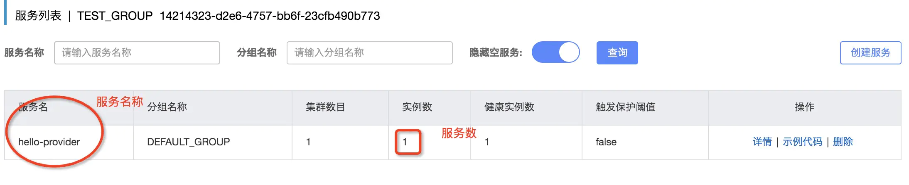
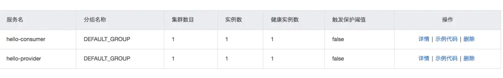
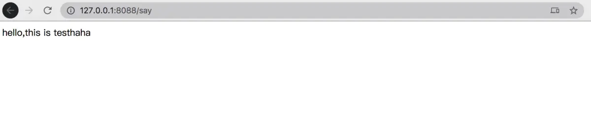

`spring cloud`微服务已经出来好久了，对于规模不大的团队来说，我们尽量去选择市面上比较成熟的解决方案，避免重复造轮子。废话不说了，今天我们就来用`spring cloud` 搭建微服务。

## 技术选型

- `alibaba spring cloud`
  > 发现阿里已经开源了一套 cloud 是基于 spring cloud 基础上，在加上阿里自带的一些工具，那就直接学习用阿里
- `dubbo`
  > spring cloud 自带的服务服务方式是 Feign 和 RestTemplate， alibaba spring cloud 新增了 dubbo 的请求方式，同时也兼容原有的请求方式，这里我们就直接用 dubbo
- `nacos`
  > 服务注册管理直接用阿里提供的 nacos，spring cloud 的注册中心用的是 Eureka

## 开发搭建服务提供方

- 引用依赖的底层包，直接引用`alibaba spring cloud 2.2.1`版本，关于版本可以参考阿里提供的 wiki https://github.com/alibaba/spring-cloud-alibaba/wiki/版本说明，这里搭建本地的nacos服务先忽略

```bash
<! -- spring boot 基础版本依赖-->
<parent>
    <groupId>org.springframework.boot</groupId>
    <artifactId>spring-boot-starter-parent</artifactId>
    <version>2.2.5.RELEASE</version>
</parent>
```

spring cloud 的相关依赖

```bash
<!-- spring cloud的相关依赖-->
<dependencies>
    <dependency>
        <groupId>org.springframework.cloud</groupId>
        <artifactId>spring-cloud-dependencies</artifactId>
        <version>Hoxton.SR3</version>
        <type>pom</type>
        <scope>import</scope>
    </dependency>

    <dependency>
        <groupId>com.alibaba.cloud</groupId>
        <artifactId>spring-cloud-alibaba-dependencies</artifactId>
        <version>2.2.1.RELEASE</version>
        <type>pom</type>
        <scope>import</scope>
    </dependency>
</dependencies>
```

- api 接口开发

```java
/**
 * 测试服务信息
 */
public interface SpringTestService {

    /**
     *
     * @param message
     * @return
     */
    String test(String message);
}
```

- api provider 开发，我们直接对外暴露`dubbo`的服务，需要把服务注册的依赖，以及`dubbo`的依赖进来

```bash
       <!-- nacos 注册的依赖-->
       <dependency>
            <groupId>com.alibaba.cloud</groupId>
            <artifactId>spring-cloud-starter-alibaba-nacos-config</artifactId>
        </dependency>
        <dependency>
            <groupId>com.alibaba.cloud</groupId>
            <artifactId>spring-cloud-starter-alibaba-nacos-discovery</artifactId>
        </dependency>

        <!-- dubbo的依赖-->
        <dependency>
            <groupId>com.alibaba.cloud</groupId>
            <artifactId>spring-cloud-starter-dubbo</artifactId>
        </dependency>
```

- 接口的实现，注意注解 Service 是`dubbo`的 service 的注解，org.apache.dubbo.config.annotation.Service

```Java
@Service
public class SpringTestServiceImpl implements SpringTestService {

    @Override
    public String test(String message) {
        return "hello,this is test"+ message;
    }
}
```

- 添加配置文件，bootstrap.yml 配置

```bash
#服务端口配置
server:
  port: 8019

#dubbo的配置，和正常开发dubbo的配置一样，不过registry.address不是配置的zk，配置是nacos 本地搭建的服务
dubbo:
  scan:
    base-packages: com.em.hello.provider
  protocol:
    name: dubbo
    port: -1
  registry:
    address: nacos://127.0.0.1:8848

#spring cloud的配置
spring:
  application:
    #服务应用名称
    name: hello-provider
  main:
    allow-bean-definition-overriding: true
  cloud:
    #nacos的相关配置，具体配置都可以参考nacos的官方文档
    nacos:
      discovery:
        server-addr: 127.0.0.1:8848
        #nacos后台配置的命名空间
        namespace: 14214323-d2e6-4757-bb6f-23cfb490b773
      config:
        server-addr: 127.0.0.1:8848
        #需要从后台去读配置，可以配置默认后缀是properties
        file-extension: properties
        namespace: 14214323-d2e6-4757-bb6f-23cfb490b773
        #nacos后台配置的组
        group: hello-provider-service
```

- 主函数方法，注意要添加`spring cloud`注解 EnableDiscoveryClient

```Java
@SpringBootApplication
@EnableDiscoveryClient
public class DubboProviderBootstrap {

    public static void main(String[] args) {
        new SpringApplicationBuilder(DubboProviderBootstrap.class)
                .run(args);
    }
}
```

启动主函数，可以在本地搭建的服务注册中心 nacos 找到


## 开发搭建服务使用方

- 引用依赖的底层包，除了`alibaba spring cloud`的相关依赖，添加`spring boot`的依赖

```bash
<!-- spring boot的依赖包-->
<dependency>
    <groupId>org.springframework.boot</groupId>
    <artifactId>spring-boot-starter-web</artifactId>
</dependency>
<dependency>
    <groupId>org.springframework.boot</groupId>
    <artifactId>spring-boot-actuator</artifactId>
</dependency>
```

- 对外提供服务的 restful 服务

```Java
@RestController
public class TestController {

    /**
     * dubbo的依赖服务
     */
    @Reference
    private SpringTestService springTestService;

    @GetMapping("/say")
    public String hello() {
        return springTestService.test("haha");
    }
}
```

- `bootstrap.yml`的配置，和服务提供方的配置一样，需要注意 dubbo 的配置有所区别

```bash
dubbo:
  registry:
    address: nacos://127.0.0.1:8848
  cloud:
     #需要订阅的服务，服务名称默认就是配置的application.name
    subscribed-services: hello-provider
```

- 一样需要启动 main 函数。配置和服务提供方的一样，启动服务会在`nacos`后台看到服务信息
  
- 浏览器直接测试返回结果信息
  

## 其他

这里只是很简单的利用`nacos`作为注册中心，`dubbo rpc`作为通讯协议，搭建的`spring cloud`的微服务，具体实际生产过程中，还需要注意很多问题，不过`alibaba spring cloud`提供的服务注册，配置中心，限流等应用已经可以用在实际生产过程中，后面在搭建一个从网关，到微服务的整套微服务系统
