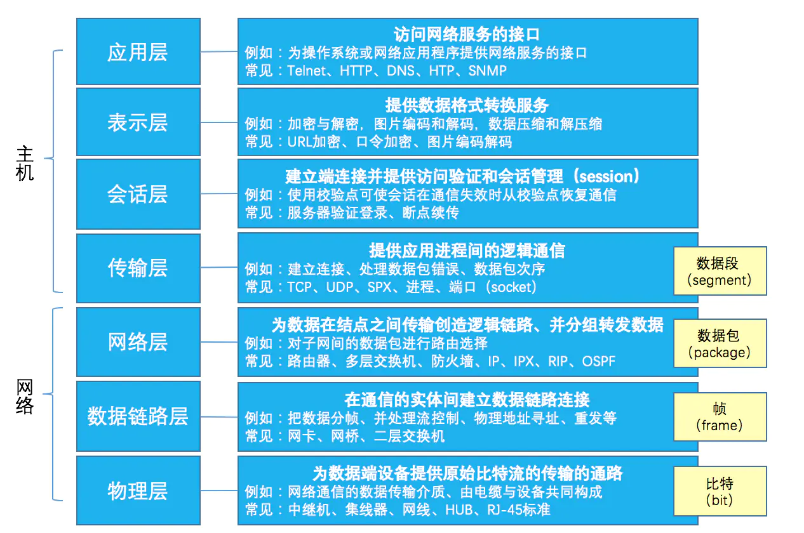
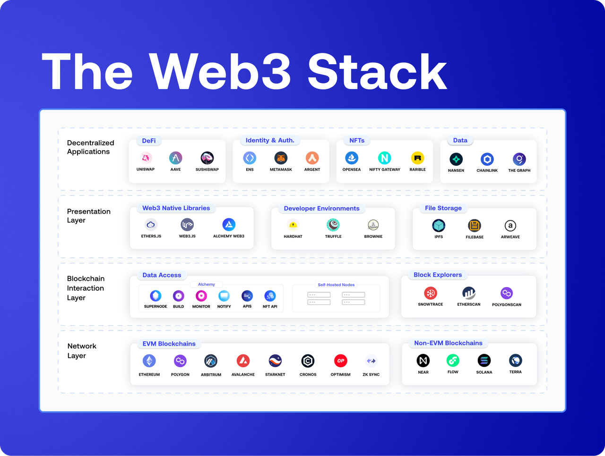

<!-- 其他 Markdown 内容 -->
## 区块链介绍

区块链是一种安全共享的去中心化的数据账本。区块链技术支持一组特定的参与方共享数据。借助过区块链云服务，可以轻松收集、集成和共享多个来源的交易数据。数据被细分为多个共享区块，并以加密哈希形式的唯一标识符链接在一起。
区块链通过单一信息源确保数据完整性，消除数据重复，提高数据安全性。在区块链系统中，未经法定人数许可，数据将无法更改，这一特点有助于防范欺诈和数据篡改。换言之，区块链账本可以共享，但不能更改。如果有一方尝试更改数据，区块链所有参与方都将收到警报，知晓哪一方试图更改数据。

## 基础概念
### 什么是Layer1和Layer2

根据计算机网络通信体系架构的OSI模型（Open System Interconnection Reference Model，即开放式系统互联通信参考模型），将区块链逻辑架构划分为三层——Layer0、Layer1和Layer2。

- Layer0对应OSI模型的底层协议，大致包括物理层、数据链路层、网络层和传输层。
- Layer1大致包括数据层、共识层和激励层。
- Layer 2则主要包括合约层和应用层。

### 什么是NFT
NFT 全称`Non-Fungible Token`，通常译为非同质化代币，是指具有独特唯一性且彼此不可替换属性的数字资产，即每一种NFT都是独特的，它们提供了不同的用途和价值。NFT 是在区块链上控制的加密代币。NFT 的功能依赖于支撑它的智能合约。
#### 领域方向
- `NFT+加密游戏`
- `NFT+收藏品`
- `NFT+艺术品`
- `NFT+Defi`
NFT最大的交易平台https://opensea.io/

### 什么是GameFi
GameFi由Game（游戏）和Finance（金融）两个词组合而成，意指为玩家提供经济激励，可以边玩边赚的区块链游戏。GameFi生态系统使用加密货币、非同质化代币(NFT)和区块链技术打造虚拟游戏环境。玩家通常可以通过完成任务、与其他玩家对战以及通关升级来赚取游戏内奖励，还可以将游戏资产转出，在加密货币交易平台和NFT市场进行交易。GameFi可持续发展的关键在于持续为玩家产生收益。
链上游戏应用查看：https://dappradar.com/rankings/category/games/1

#### 玩法模式
主要是X to Earn模式，介绍两种目前比较火热的模式
- P2E（`Play 2 Earn`） 游戏行为经济，代表项目Axie Infinity，The Sandbox
- M2E（`Move to Earn`）运动行为经济，代表项目StepN

### 其他
- DAO （`Distributed Autonomous Organization`） 去中心化自治
- DApp（`Decentralized Application`）去中心化应用
- DID（`Decentralized Identity`）去中心化身份认证
- DEX（`Decentralized exchange`）去中心化交易

## 基础链
### 共识机制
| 共识机制 | 优点 | 缺点 | 区块链 |
| --- | --- | --- |--- |
| POW （工作量证明） | 通过“挖矿”的方式来奖励参与着获取相应的Token，公平性高 | 算力，资源问题，安全性问题 |BTC |
| POS  （股份权益证明）| 参与门槛低，更去中心化 | 中心化信用问题 |ETH(POW+POS)，NXT |
| DPOS （授权股权证明机制) | 确认速度快，更去中心化 | 参与度问题，中心化信用问题 |EOS（DPoS+BFT）|
| POSA（股权证明机制的共识模型） | 验证速度快 |  |BSC |
| PBFT（实用拜占庭容错算法） | 算法可靠性高 | 有1/3或以上停止工作后，系统将无法提供服务 |Ripple |

### 数字钱包
数字钱包中包含成对的私钥和公钥，公钥用于交易转账，私钥用于签名和解密。加密货币钱包不会真正存储数字资产。
钱包目前类型有
- App钱包
- 浏览器插件钱包
- 桌面钱包
- 热钱包

### 公链
以太坊以及智能合约带来了`DeFi,  NFT, GameFi`，以至于metaverse等领域的发展，但以太坊链上应用的爆炸式增长也导致了链上容量不足的问题，从而造成高昂的gas fee费用。目前以太坊2.0正在升级中，由PoW(工作量证明)区块链转向PoS(权益证明)区块链的技术升级中，升级后的以太坊2.0将会大幅提高容量和速度。目前新兴的L1公链主要是Pos技术，主要包括`Binance Smart Chain, Solana, Avalanche, Terra`等。
| 公链名称 | 主网上线时间 |    基础信息   | 共识机制 | 区块链浏览器 | 代币 |   生态    |
| --- | --- | --- |--- |--- |--- |--- |
| BSC | 2020/9 | - 平均出块时间大约3秒 - gas费用 0.03$ - 以太坊虚拟机兼容，与币安链并行的区块链，支持智能合约，支持以太坊工具和DApp - TPS： 50～100 - 综合性公链，用户群体大，支持钱包多 - 语言：Solidoty,Vytype - Layer1 - 有单独钱包|PoSA 共识机制 |https://bscscan.com/  |BNB|[Dapp项目](https://dappradar.com/rankings/protocol/binance-smart-chain)  [Defi项目](https://defillama.com/chain/BSC) |
| Solana | 2020/3 | - 平均出块时间大约2秒 - gas费用低，0.00001$ - 不兼容以太坊EVM - TPS：50000+ - 属于综合性公链，安全性不足 - 语言：Rust,C,C++ - Layer1 - 有单独钱包|PoH（历史证明）+PoS(股份权益证明） |https://solscan.io/ |SOL|[Dapp项目](https://dappradar.com/rankings/protocol/solana)  [Defi项目](https://defillama.com/chain/Solana) |
| Avalanche | 2020/9 |- 平均出块时间大约1秒 - gas费用低，0.0001$ - 有三条主网络（X链，C链，P链）C链该链实现了以太坊虚拟机(EVM)的一项实例，支持兼容EVM的DApp - TPS：4500+ - 综合性公链，跨链通信 - 语言：Solidoty,JS - Layer1 - 有单独钱包|POS（DAG有向无环图|https://explorer.avax.network/ |AVAX|[Dapp项目](https://dappradar.com/rankings/protocol/avalanche)  [Defi项目](https://defillama.com/chain/Avalanche) |
| Polygon | 2020/5 |- 平均出块时间大约2.5秒 - gas费用低，0.0001$ - 支持以太坊EVM，主要网络分为安全链和独立链 - TPS：7200+ - Polygon是一种框架，用于创建与以太坊兼容的区块链扩展解决方案。Polygon网络则是一种权益证明(PoS)侧链 - 语言：Solidoty - Layer2 - 有单独钱包|POS（股份权益证明）|https://polygonscan.com/ |MATIC|[Dapp项目](https://dappradar.com/rankings/protocol/polygon)  [Defi项目](https://defillama.com/chain/Polygon) |

### web3.0
目前将Web 3大致划分为了四个层级：网络层、区快链交互层、表示层和应用层。

#### Web3 网络层
Web3 技术栈的基础是区块链网络层。虽然 Web2 应用程序依赖于集中式数据库，但 Web3 应用程序构建在区块链架构之上，可实现无信任和无许可访问。

###### 基于以太坊虚拟机或EVM 的区块链
- 以太坊- 原创 EVM 智能合约平台
- Polygon - 以太坊侧链
- Arbitrum - 使用乐观汇总和多轮欺诈证明的第 2 层区块链
- Optimism - 使用 Optimistic rollups 和单轮欺诈证明的第 2 层区块链
- Hermez - 由 Polygon 管理的 ZK 汇总以太坊第 2 层网络
- ZKSync - 使用 SNARK 的 ZK 汇总以太坊第 2 层网络
- Starknet - 使用 STARK 的 ZK 汇总以太坊第 2 层网络
- Avalanche - 与 EVM 兼容的第 1 层
- Cronos - EVM 兼容的第 1 层

###### 非EVM 的区块链
- Flow - 第 1 层使用 Cadence，Flow 的原生面向资源的编程语言没，主要专注NFT区块链
- NEAR - 第 1 层使用 Rust 或 Assemblyscript 进行智能合约
- Solana - 使用 Rust C、C++ 的第 1 层智能合约
- Terra - 将 Rust 用于智能合约的第 1 层

## 参考资料
- https://ethereum.org/zh/nft/
- https://ethereum.org/zh/defi/
- https://ethereum.org/zh/layer-2/
- https://ethereum.org/zh/web3/
- https://yeasy.gitbook.io/blockchain_guide/
- https://gamefi.org/
- https://www.web3.university/article/web3-stack
