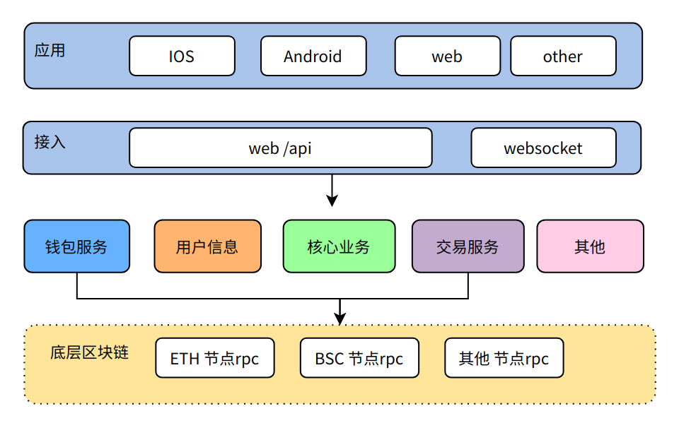
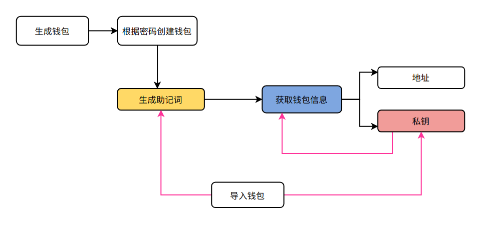
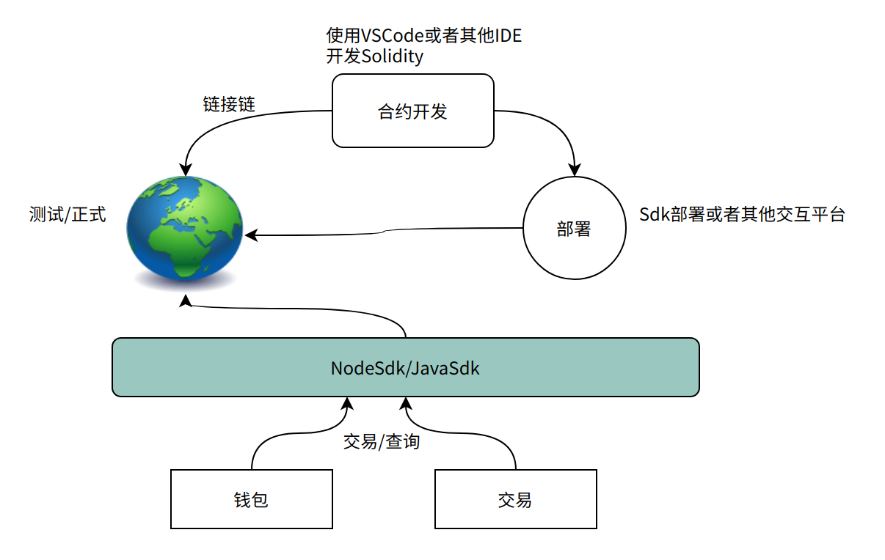
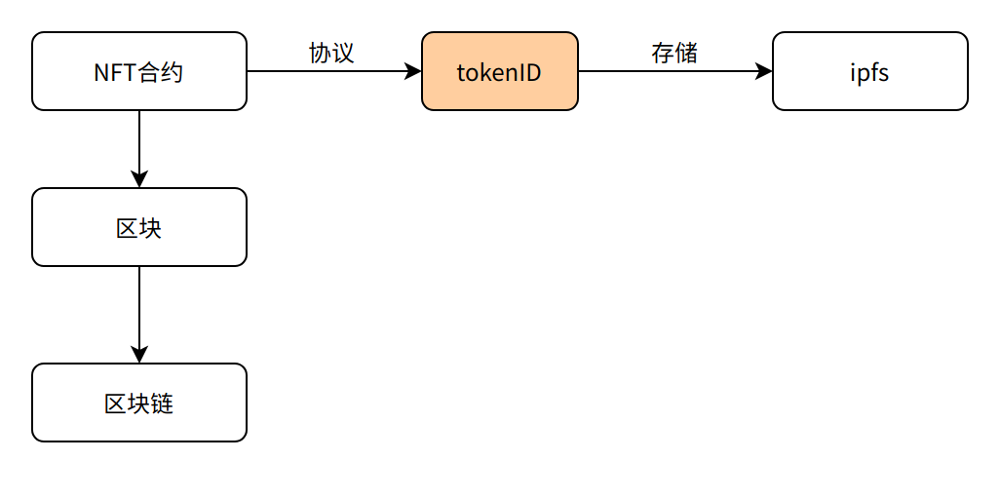

<!-- 其他 Markdown 内容 -->

## 背景

web3 的项目涉及到的主要技术都是区块链相关的技术，业务场景不限于`Token`,`NFT`,`Defi`之类，本产品主要会涉及到 Token 和 NFT。我们选择 EVM 系类和非 EVM 系类的区块链差别还是很大。

## 区块链

- EVM 系类公链
  以太坊系类的链，`Polygon`，`Avalanche`比如底层技术都是基于以太坊，所以上层的应用都是可以做到兼容，包括`ERC20`系列 token，以及`ERC721`系列的 NFT，市面上兼容的钱包也比较多。
- 非 EVM 系列公链
  这类公链的合约是不支持 evm 虚拟机，合约的开发基本上也是自己独自的语言，生态系统需要看各自公链的发展。代币协议都有各自的协议（`Solana`的 SPL 协议）， 不过几乎都和`ERC-20`协议类似。不过目前都有这种跨链的协议，支持不同链之间的 Token 流通。

## 简单技术方案



- `web3.0`和`web2.0`的整体技术在于用户的一些私有信息都是存储到去中心的链节点上面，不再是中心化存储，但是一些其他数据还是要依赖常规的存储方式。底层是区块链，数据库的相互结合。
- `web3.0`区块链涉及的主要技术点是：`RPC`，`JSON-RPC`,RPC 是目前链上对应用开放的 API 接口，JSON-RPC，是目前绝大数链对外请求的方式。

## 钱包

web3.0 的应用上的钱包目前都是热钱包，去中心化的钱包，基本上目前大多数都是通过第三方应用钱包进行登陆，利用三方钱包的功能实现资产的展示。

### 钱包主要功能

生成助记词、Keystore 文件、私钥创建钱包账号。这是是生成一个钱包的基本，目前客户端钱包技术上可以直接采用 web3j 前端的 js 接口和链上 RCP 交互，基本上包含一下几个核心步骤：

1. 生成一个随机数种子；
2. 通过随机数种子得到助记词；
3. 通过 种子 + 路径 派生生成私钥；
4. 使用 KeyStore 保存私钥；
5. 私钥推倒出账号地址。
   一个钱包的主要功能：
6. 账号管理（主要是私钥的管理）：创建账号、账号导入导出
7. 账号信息展示：余额、Token（代币）余额。
8. 转账功能：发送 Token（代币）
9. 数字藏品展示：NFT

### 钱包流程

1. 通过私钥导入钱包
2. 通过 KeyStore 文件导入钱包
3. 通过助记词导入钱包
   

### 钱包需要技术

- web3.js 开发文档：：`web3.js`，`ethers.js`
- web3j 后端文档: `java`客户端版本，`Go`客户端版本，`Python`客户端版本

## Token 合约

`Token`都是基于某个公链发行的同质化代币，基本上以太坊系列的代币基本上协议都是基于`ERC-20`，不同的链虽然协议稍微有点差异，但是在开发上都是基于 Solidity 语言进行处理，技术上我们选型以太坊系列的 Layer1 和 Layer2，都会设计到合约开发。</br>
Token 这块涉及到节点信息使用，目前根据市场的其他应用以及我们自身的情况，建议使用三方提供的服务节点，比如 Infura。涉及到的开发框架如下：

1. `Hardhat` 或者`truffle` 合约开发框架
2. Node，Js，Ts 等前端语言
3. `openzeppelin` 等合约继承框架
   **其中`Hardhat`目前基本上是合约开发框架中比较完善的，继承了一些基础库。**
   
   > 以太坊系列合约和应用的交互可以通过 web3.js，ethers.js 两种 NodeSdk 进行交互。

### Token 系列协议

- ERC-20<br>
  > 目前基于以太坊坊为基础的 Token 基本上都是以 ERC-20 为基础，发行代币。兼容以太坊 EVM 的代币都支持 Solidity 语言开发合约。
- BEP-20<br>
  > BEP20 是 BSC 链上的 Token 代币协议，整个合约开发也是使用 Solidity 语言，以及 Vytype 语言。
- 其他<br>
  > 其他系列的公链，Token 代币上会有差异，不过像 Solana 公链都提供了相应的 SDK 供开发者进行使用。

### 合约

合约主要是完成一些特定的业务逻辑，让区块链上去触发，比如 Defi 场景中的借贷抵押挖矿，在我们的应用中，游戏场景中的一个代币的消耗都需要合约完成这部分业务逻辑处理。

## NFT

NFT 协议目前主要是 ERC-721 的合约协议，主要是要实现 mint 功能。

- `ERC-721`</br>
  > 该协议是以太坊的针对不可置换代币的 NFT 数字资产的第一个标准
- `ERC1155`</br>
  > 其主要可用于游戏行业中道具的生成和处理。该标准的提出对 nft 在游戏行业的应用起到了极大的提升。在一定程度上融合了 ERC-20 和 ERC-721 的功能。
- `ERC998`</br>
  > 对 ERC-721 标准的扩展，使 ERC-721 代币能够拥有其他 ERC-721 代币和 ERC-20 代币。
  > NFT 的主要核心流程：
  > 
  > 合约的整体能看到所有的 NFT 信息，每个 NFT 又是一个单独的 Hash 地址，都有自己的`TokenID`，`tokenId`会对应一个`TokenURL`，`TokenURL`会获取 NFT 的一些具体信息：

```bash
 {
    "name": "My test NFT",
    "description": "this is test NFT",
    "image": "https://ipfs.io/ipfs/QmTgqnhFBMkfT9s8PHKcdXBn1f5bG3Q5hmBaR4U6hoTvb1?filename=Chainlink_Elf.png",
    "attributes": [. . .]
 }
```

image 代码这数字艺术藏品的具体 URL 信息，存储这快的方案基本上是两种：

- `链上+链下存储`
- `链上存储`
  > **链上存储目前可以选择存储在去中心化的文件存储 IPFS** </br> > **链下存储采用目前中心的化的方案，CND+OSS 存储模式**

### 交易

目前最大的 NFT 交易平台 OpenSea 支持的链主要是：Solana，以太坊、Polygon 和 Klaytn，只需要将我们 NFT 的合约地址和 OpenSea 进行关联，就可以在 OpenSea 进行售卖。
